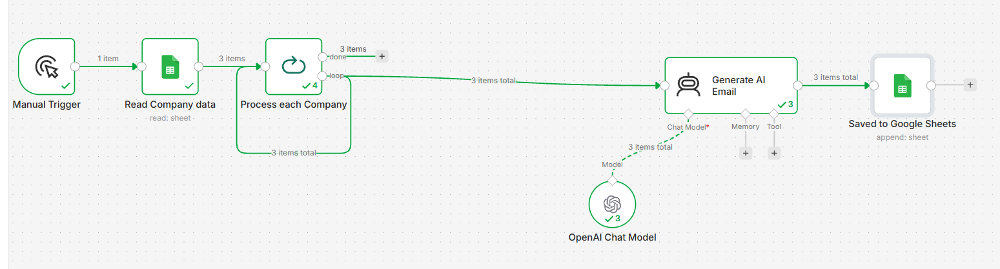
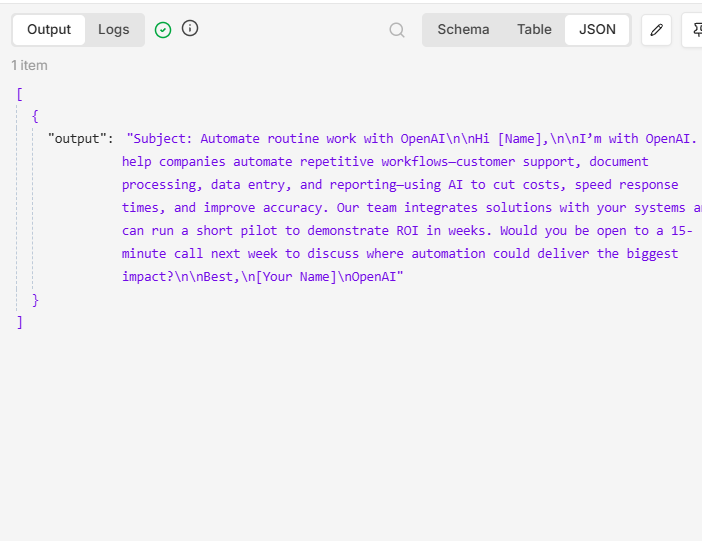

# AI-Powered Lead Generation Automation using n8n

## Project Overview

This project automates lead generation using **n8n**, **Google Sheets**, and **OpenAI**.

The workflow reads company information from Google Sheets, processes each company individually, generates personalized cold emails using AI, and automatically stores the generated emails back into Google Sheets.

---

## Features

-  Reads company data from Google Sheets
-  Processes each company individually
-  Uses OpenAI GPT-5 Mini to generate personalized emails
-  Creates AI-powered cold outreach emails
-  Saves generated emails back into Google Sheets
-  Fully automated no-code workflow

---

## Workflow

```text
Manual Trigger
      │
      ▼
Google Sheets (Read Rows)
      │
      ▼
Loop Over Items
      │
      ▼
AI Agent
      │
      ▼
OpenAI Chat Model
      │
      ▼
Google Sheets (Append Generated Email)
```

---

## Technologies Used

- n8n
- Google Sheets
- OpenAI GPT-5 Mini
- AI Agent
- No-Code Automation

---

## Screenshots

### Workflow



### AI Generated Email



### Google Sheet Output


---

## How to Import

1. Download `workflow.json`.
2. Open **n8n**.
3. Click **Import Workflow**.
4. Select `workflow.json`.
5. Connect your Google Sheets credentials.
6. Connect your OpenAI credentials.
7. Execute the workflow.

---

## Future Improvements

- Gmail integration for automatic email sending
- LinkedIn lead generation
- CRM integration (HubSpot, Salesforce)
- AI-based lead qualification
- Automated follow-up email sequences

---

## Author

**Aleena Khalid**

- Cybersecurity Student
- AI & Automation Enthusiast
- Learning n8n, AI Workflows, and Security Automation
